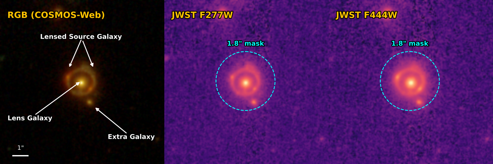

# PyAutoLens Assistant


When two or more galaxies are aligned perfectly down our line-of-sight, the
background galaxy appears multiple times. This is strong gravitational lensing,
and **PyAutoLens** makes it simple to model strong gravitational lenses.

This repository is the **PyAutoLens Assistant**: an AI assistant which **lets you use natural language** to do gravitational lensing science. 

## Getting Started

### Choosing Your AI Tool

There are two kinds of AI tool you could use the assistant with:

* **Conversational AI assistant:** Use a browser-based tool such as **ChatGPT** or **Claude** to ask questions, plan analyses, and generate scripts that you transfer to your computer and run manually.
* **CLI coding agent:** Use a terminal-based agent such as **Claude Code** or **Codex**. It can work directly on your computer to inspect `.fits` data, write and execute scripts, diagnose errors, run lens models, and inspect their results.

**Both kinds are supported, and both currently require a paid plan.** The recommended route is a CLI coding agent: the paid-subscription agents **[Claude Code](docs/setup/claude_code.md)** and **[Codex](docs/setup/codex_cli.md)**, which install **PyAutoLens**, run fits and inspect their results directly on your computer. Conversation assistants work too: **ChatGPT** on a paid plan (Plus/Pro/Team) reads this repository through its [GitHub connector](docs/setup/chatgpt_paid_connector.md), and **Claude** chat on a paid plan (Pro/Max/Team) reads it live through its [GitHub connector](docs/setup/claude_chat_paid.md).

**Free options are being tested** but do not yet have first-class support: the free coding agent **OpenCode** is the most promising (see [Free AI tools](#free-ai-tools) at the bottom of this README), and the free chat routes are listed under [Conversation Assistants](#conversation-assistants).

### Using PyAutoLens Assistant

To illustrate the `autolens_assistant` we will use James Webb Space Telescope imaging data of the 
[**COSMOS-Web Ring**](https://ui.adsabs.harvard.edu/abs/2024A&A...687A..61M/abstract), whose imaging
ships with this repository in `dataset/imaging/cosmos_web_ring`:



Take note of the **lens galaxy, lensed source galaxy, extra galaxy** and the **1.8" circular mask**, your first 
interactions with the `autolens_assistant` may ask you about how to handle these in your analysis!

The walkthrough below uses a CLI coding agent; if you are working in a conversation assistant instead, see [Conversation Assistants](#conversation-assistants).

### AI Coding Agent (CLI)

`autolens_assistant` supports the **Claude Code** and **Codex** coding agents.

Once you have your coding agent setup, clone the `autolens_assistant` repo:

```bash
git clone https://github.com/PyAutoLabs/autolens_assistant.git
cd autolens_assistant
```

Next, open your AI coding agent in your terminal inside the `autolens_assistant` folder you just cloned. 
If `PyAutoLens` is not already installed, the coding agent will use `autolens_assistant` to install it after you submit your first prompt.

Here is a good initial prompt to try it out, noting that data for the COSMOS-Web Ring is included in this repository as an example:

```
Find the data on the Cosmos-Web ring, give me a short script to plot it in PyAutoLens and then given that I'm a 
new user give me an overview of the different ways we can perform strong lens modeling of this system.
```

If you want to see `autolens_assistant` perform end-to-end lens modeling:

```
I want to model the F277W and F444W JWST imaging of the COSMOS-Web Ring independently, which are in 
the folder dataset/imaging/cosmos_web_ring. Model the lens light with a multi-Gaussian expansion (MGE), its mass with a singular 
isothermal ellipsoid plus external shear, and model the source also using an MGE. For speed, run the analysis on my 
laptop GPU using a JAX optimizer that estimates only the maximum-likelihood solution. Plot the observed image at 
each wavelength in the left column, its lensed source model in the middle column, and its source on the right column.
```

## Customize Your Assistant

The `autolens_assistant` adapts its behaviour to suit your prompt:

- Want to plan your lens modelling analysis and compare the available approaches? Simply say so in your initial prompt.

- Want the assistant to ask questions before performing a task, helping you understand the analysis and make informed choices? Ask it to guide you through the process.

- Want it to complete a task end-to-end without consulting you? Tell it to **one-shot** the task.

If you are new to gravitational lensing, particularly an undergraduate or early-stage PhD student, ask the assistant 
to use **Teacher Mode**. It will explain the fundamentals of lensing and lens analysis in greater detail, while providing direct links to relevant, human-readable documentation so that you can understand what **PyAutoLens** is doing.

## Example Prompt 1 (Teacher Mode): Simulate, inspect and model a strong lens

A good first session if you are new to PyAutoLens and want to learn the modelling workflow end-to-end using data you 
generate yourself. Starting with a simulation keeps things simple: the data are clean, the true model is known, and
there are no observational complications, allowing you to focus on understanding each step.

```
Teacher mode.

I'm new to PyAutoLens and want to learn the basic workflow end-to-end. Can you
walk me through a simple example where we: 1) simulate Euclid-like imaging of
a simple strong lens; 2) make some plots of the lens and investigate its properties and;
3) fit the data and recover the lens model.
```

## Example Prompt 2 (Assistant Mode): Detect a Dark Matter Subhalo in SLACS0946+1006

This example demonstrates how far the assistant can be pushed in performing a scientific analysis. The prompt 
aims to reproduce the famous dark matter subhalo detection in the strong lens SDSSJ0946+1006 and investigate 
evidence that its density profile is unusually concentrated. It does this through Bayesian model comparison.

The lens modelling required for this analysis may take hours or days. The final sentence asks the assistant to 
estimate the runtime and, if necessary, guide you through setting up and running the analysis on a High Performance 
Computing (HPC) system to which you have access.

```
Assistant mode.

The strong lens SDSSJ0946+1006 famously has a dark matter subhalo
detection that studies show is unusually concentrated. Analyse
the HST imaging of this lens provided at
dataset/imaging/slacs0946+1006/ and reproduce the detection.

Perform Bayesian model comparison to (a) confirm a subhalo is preferred 
over a smooth-mass baseline which does not include a subhalos, and (b) test
the "super-concentrated" claim by comparing an SIS subhalo model
against a more shallow NFW mass profile at the recovered position.

For the lens light use a Multi Gaussian Expansion, for its mass use a 
Power Law plus shear and use a Delaunay mesh for the source reconstruction.

Assess whether the analysis will run fast on my laptop / PC CPU or GPU,
and if not, set this up as a small project on the HPC I have access to.
```

## Example Prompt 3 (Assistant Mode): Complex tasks combining different data and lensing scales

`PyAutoLens` provides comprehensive JAX support, enabling fast modelling through GPU acceleration and automatic 
differentiation. Galaxy-, group-, and cluster-scale lens models can be constrained using CCD imaging, 
interferometer visibilities, point-source observables, and weak-lensing catalogues entirely within JAX.

These are not isolated capabilities: they can be combined in a single joint inference. Previously, the challenge 
was navigating the different APIs and integrating them into a single Python script. With `autolens_assistant`, 
you can instead describe the analysis in **natural language** and let the assistant construct the required workflow:

```
Assistant mode.

Simulate imaging and interferometer data of a group-scale strong lens, which is composed of
two SIE lens galaxies and a quadruply imaged Cored Sersic background source. Include a weak lensing
shear catalogue comprising 30 galaxies up to 20.0" away from the group centre.

Next, write a script which perform modeling of this dataset, simultaneously fitting the imaging data, 
interferometer data and shear catalogue. Model the foreground lens using  multi gaussian Expansions for its 
light, SIE's for each lenses mass and a multi Gaussian expansion for the background source. 

After this fit has been judged successful, do a follow up lens model that uses a pixelized source 
reconstruction.
```

## Science Project

When you begin a specific scientific study, `autolens-assistant` can create a dedicated science project: a 
logically structured folder linked to a GitHub repository containing the datasets, configuration files, analysis scripts, 
results, plotting scripts and a full transcript with the assistant for reproducibility. Every script generated by the 
assistant is fully documented and can be converted automatically into a Jupyter notebook, with its 
explanations becoming Markdown cells and its Python becoming executable code cells. The GitHub repository then 
provides a straightforward way to share results with collaborators, so they can inspect the project’s current state,
understand how each analysis was performed, and provide suggestions or build on the project. Projects can 
also interface directly with HPC facilities through bidirectional synchronization, CPU and GPU job submission and 
monitoring. If the study leads to a paper, the completed repository can therefore serve as the paper’s open-source 
companion, enabling readers to reproduce the study end to end or fork it as the starting point for further research.

To start a science project, just add it to your input prompt:

```
Start a science project for my SDSSJ0946+1006 analysis.
```

## Benchmarks

The three example prompts above (plus the hard cross-package benchmark) are
also shipped as **frozen benchmark prompts** under [`benchmarks/`](benchmarks/),
with scoring rubrics and a small harness that records each run's conversation,
results and score. Run them against different AI agents and models — or the
same model on different days — and the committed run records in
`benchmarks/runs/` plus the regenerated tables in `benchmarks/RESULTS.md` give
you an evidence-backed comparison of how well each setup drives the assistant.
The protocol is in [`benchmarks/README.md`](benchmarks/README.md).

## Scientific Context

The assistant doesn't just know how to use PyAutoLens API — it ships with a
strong-lensing **literature wiki** at `wiki/literature/`. This provides
contexrt on other 300 strong lensing papers, broken down into concept pages
(e.g.mass-sheet degeneracy, dark-matter substructure, time-delay cosmography, 
multipoles), surveys (e.g. SLACS, H0liCOW, TDCOSMO, Euclid Q1, Abell 1201,
…), and other subject categories. This means that, for example, if your prompt
mentions ALMA and submm galaxies, the assistant's response will consider
the wider scientific literature and context.

This **base** literature wiki can and should be extended by you, with papers that are
specifically relevant to your scientific study. Doing this is simply, simply
point the assistant to the papers and it'll ingest them for you:

```
Ingest the following paper into the literature wiki so you can use it
when we talk about subhalo detection:

  arXiv:2401.01234

(Or, if you have the PDF locally: /path/to/subhalo_paper.pdf)

Once it's ingested, summarise the paper and how it complements similar
works in the literature wiki
```

The more papers relevant to your science case you load in, the better
the assistant will be at framing decisions, citing prior work, and
spotting when a result has caveats.

## How does PyAutoLens-Assistant actually work?

The `autolens-assistant` starts with the general knowledge and reasoning capabilities of 
the underlying foundation model you call it with (e.g. ChatGPT's GPT5.6Sol model, Claude's Opus 4.8 model). 
The `autolens-assistant` supplements this with the scientific wiki above and two more sets of AI-readable markdown. 
The folder `wiki/core` provides it with a quick look-up mechanism of the PyAutoLens API documentation. The folder
`skills` pairs it with the end-to-end analysis scripts found in the [`autolens_workspace`](https://github.com/PyAutoLabs/autolens_workspace). When the `autolens-assistant` 
receives your prompt, it scans these folders to give you the best possible answer
you need. The JOSS paper located in the `paper` folder provides a more detailed description.

## Conversation Assistants

Conversation assistants such as **ChatGPT** and **Claude** used in a browser **are supported**, on a paid plan. In
chat the assistant does the thinking work — planning models, writing current-API scripts for you to run, explaining
concepts and reviewing your errors and figures. It cannot run fits or read the `.fits` files on your computer; for
that, pair it with a coding agent, which shares the same subscription.

| Option | Cost | How well it works |
|---|---|---|
| **[ChatGPT](docs/setup/chatgpt_paid_connector.md)** | Paid (Plus/Pro/Team) | Works brilliantly via GitHub sync (different from the custom GPT) |
| **[Claude chat](docs/setup/claude_chat_paid.md)** | Paid (Pro/Max/Team) | Works brilliantly via its GitHub connector |
| **[Claude chat](docs/setup/claude_chat_free.md)** | Free | Works via project setup, but the free tier's GitHub connector is missing features that hurt performance, and it goes through the free tokens quickly |
| **[ChatGPT custom GPT](docs/setup/chatgpt_custom_gpt.md)** | Free | Works, but not yet able to do all tasks (experimental) |
| **[Paste the bundle](docs/setup/paste_bundle.md)** | Free | Reliable fallback for any AI chat |

On paid plans both ChatGPT and Claude read this repository live through their GitHub connectors; on free plans use the
routes in the table.

The free routes are worth knowing about but are degraded: the experimental
**[PyAutoLens AI Assistant custom GPT](https://chatgpt.com/g/g-6a74c33c58c48191b8cd353e7b46f18b-pyautolens-ai-assistant)**
is available on any ChatGPT plan, but be warned that its performance is currently not great and it cannot yet do
everything the coding agents can.

Once set up: [first prompts to try](docs/setup/first_prompts.md) · something misbehaving?
[troubleshooting](docs/setup/troubleshooting.md).

## Free AI tools

We are actively testing free AI tools, but cannot yet provide first-class support for any of them. The free coding
agent **[OpenCode](docs/setup/opencode_cli.md)** is the most promising option so far, with preliminary testing showing
encouraging results — if you do not have a paid Claude Code or Codex subscription it is the one to try. The free chat
routes are in [Conversation Assistants](#conversation-assistants) above.

## Natural-language development ecosystem

In March 2026, following more than a decade of exclusively human-led software development, `PyAutoLens` transitioned
to a fully natural-language, agentic-AI development ecosystem called
[`PyAutoScientist`](https://github.com/PyAutoLabs/PyAutoScientist). The ecosystem is organised as a software organism
whose core repositories mirror the roles of human organs:
[`PyAutoBrain`](https://github.com/PyAutoLabs/PyAutoBrain) acts as the reasoning centre, classifying, planning, and
routing tasks through specialist coding agents; [`PyAutoMind`](https://github.com/PyAutoLabs/PyAutoMind) captures
intent by recording plain-English development requirements and tracking them from initial ideas to completed
implementations; and [`PyAutoMemory`](https://github.com/PyAutoLabs/PyAutoMemory) provides long-term scientific memory
through cross-linked literature wikis and verifiable citations. Humans remain firmly in the loop, defining the
scientific objectives, supervising the development process, and approving consequential decisions.

## License

This repository is released under the [MIT License](LICENSE), consistent with the wider
PyAuto\* ecosystem. The assistant ships agent instructions and reference material derived
from the public PyAuto\* repositories; the underlying libraries are released under their
own licenses (see each repo).

<sub><i><a href="https://open.spotify.com/track/6LeTQu4NvTnLRRiB8GVFQe">if you don't know, don't worry</a></i></sub>
